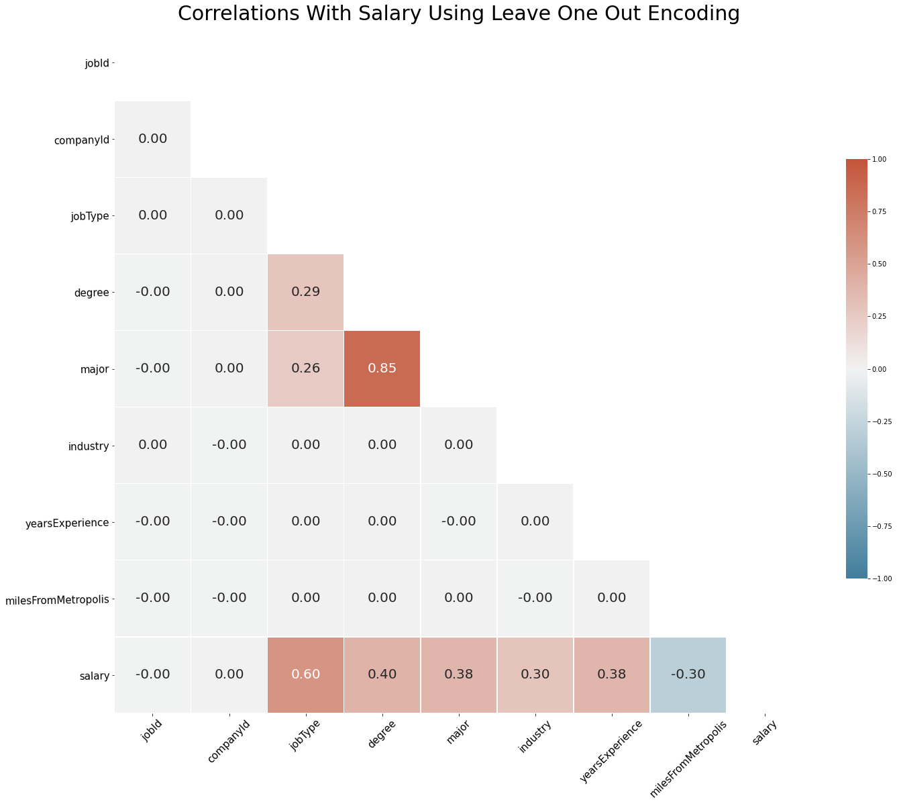
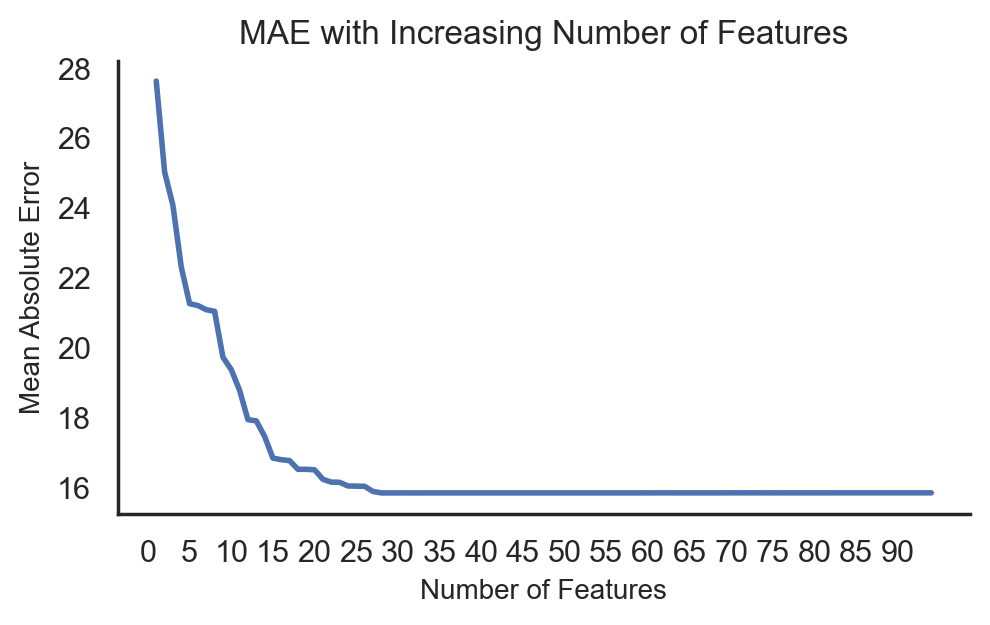
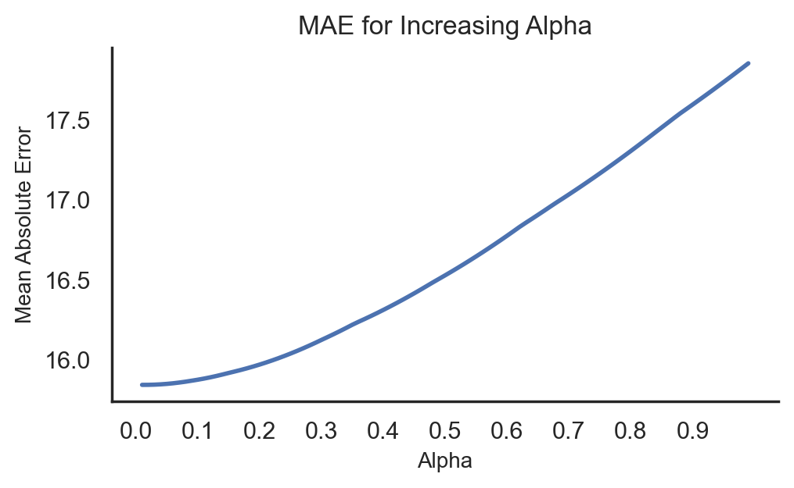

# Salary Estimator
- Created a baseline model to predict MAE by predicting set values of 50k, 100k, the mean, 150k and 200k. 
- Demonstrated different ways to reduce model complexity of Linear Regression, Lasso Regression and Gradient Boosting while reducing the Mean Absolute Error.
- The best model reduced the MAE to 15.33.
  
---
### Motivation
The scenario of my project is a data scientist at a  ficticious company ABC is asked to understand why potential employees are not accepting the offer letters. Your manager knows that it cannot be the location, benefits, etc. because of how stellar they are and that it has to be the salary. 

Obviously, reducing the objective function (mean absolute error) is the desired result. But I wanted to see if I could get similar results without having to use all of the data. If ABC is offering lower salaries, maybe there  is an issue with funding. So I focused on getting the best results but also reducing model complexity to save money on run time.

---
### EDA
I started the exploratory data analysis by building violin charts. These charts are simular to box plots but with the added addtion of a a density plot. This shows the probability for each salary for the different categories.

To be able to build the correlation heatmap I used Leave One Out Encoding on the categorical features. We can see that the type of job is the most correlated with salaries.

### Modeling
I first transformed the categorical variables. To do so I used the column transformer to one hot encode the categorical features and left the numerical features alone. I did not split the data as I had a training and a test set to start with. 

I used 3 different models to show different ways to not use all the features, tune or stop training early. I chose to evaluate the models on MAE (mean absolute error) because it is relatively easy to explain in terms of money to business people. And outliers do not affect very much.

**Baseline** - Used to predict a constant value to see if more complex models obtain a better result. The goal is to use more complex models to beat the baseline models. I used 5 different constant predictors:
    - 50K: MAE = 66.14
    - 100K: MAE = 32.91
    - 116 (average): MAE = 31.01
    - 150K: MAE 43.14
    - 200K: MAE = 84.69
  We can see that using the average as a constant predictor obtained the best MAE.

  **Linear Regression** For each iteration of a for loop, using SelectKBest a feature was added based on the F-Score and calculated a new MAE. As you can see from the chart, the more features the lower the MAE went. But you can also see that the reduction also became flat after using the best 28 features. The best model factoring in complexity and MAE was with 28 features and MAE ~ 

 
 
  **Lasso Regression** For each iteration of a for loop I increased the alpha parameter, regularization, of the lasso regression model. We can see that the more penalized the model gets the worse the MAE. With the alpha at .01 we almost using a linear regression model, but with a tiny amount of regularization.

  

  **Gradient Boosting** To show the effects of early stopping has on gradient boosting, I ran a model with and without stopping early. What early stopping does, is if after a user defined number of iterations the loss function (in this case MAE) does not improve by a user defined tolerance the model stops running.

  We can see here that after 354 iterations the model stopped running and was only .005 worse than when the model ran for 1000 boosting stages.

  If after 25 boosting stages the model did not improve by .001, the model stopped running.
  
  

### Future Ideas
I'd first like to iterate to my manager, in this scenario, that we can build a model but we still do need to use human intuition because models are not 100% correct all the time.
  - I'd like to have data that wasn't so clean to start with so I can work on my data cleaning and feature engineering skills.
  - I think if the data were more similar in the job types we would be able to reduce the MAE even more. What I mean is if we are hiring for a specific position, gather data for similar roles not ranging from CEO to janitor.
  - As always, I'd like to build an artificial neural network. Maybe
  - For gradient boosting I would also like to optimize the other hyper parameters.
